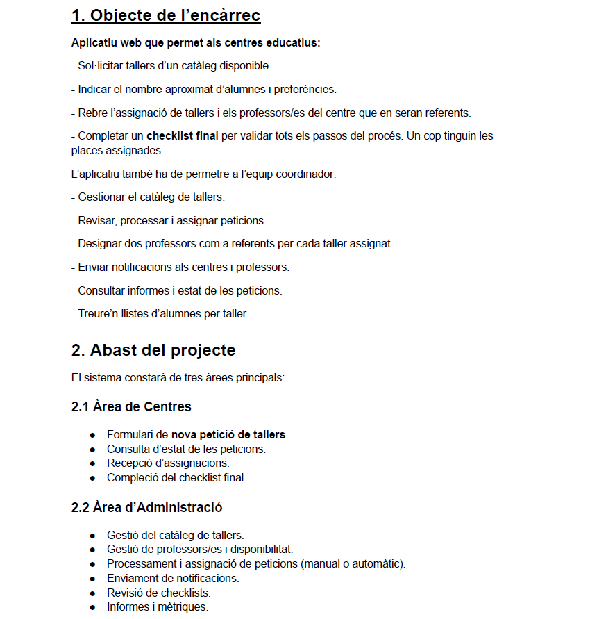
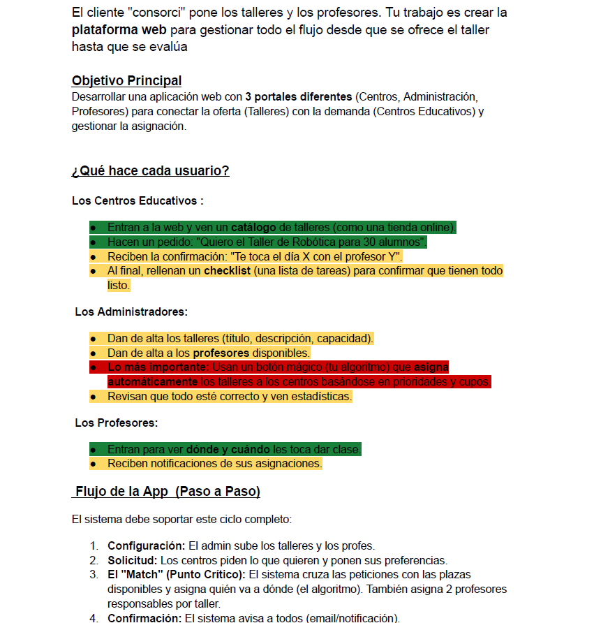
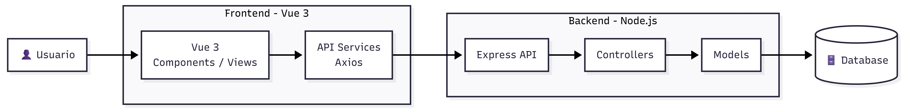

# Documentació

En aquesta part de la documentació es troba la documentació bàsica del projecte.

## Objectius del projecte

Els objectius del projecte están apuntats en aquest [PDF](./ObjectiusTR2.pdf)

## Planificació del projecte

La planificació del projecte està apuntada en aquest [PDF](./DOCUMENT_DE_PLANIFICACIÓ_TÉCNICA_Y_FUNCIONAL.pdf)

## Diagrames

Aquí tenim els diagrames del projecte:

### Diagrama de Casos d'Ús

### Diagrama de Relació de la Base de Dades

## Esquema d'estructura de tecnologies

En aquesta imatge es troba l'estructura de tecnologies que hem utilitzat per a desenvolupar el projecte.

